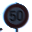
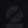
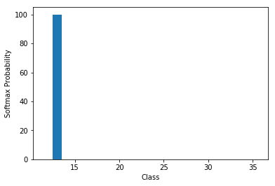
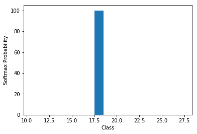
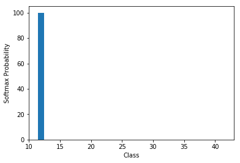
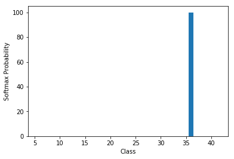
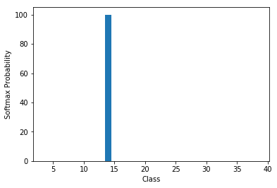
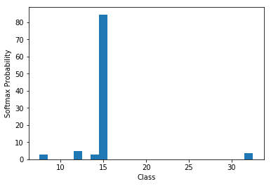

# Traffic Sign Recognition

#### This project aims to write a software pipeline using deep neural networks and convolutional neural networks to classify traffic signs. Herein, I have used the <a href="https://benchmark.ini.rub.de/?section=gtsrb&subsection=dataset" target="_top">German Traffic Sign Dataset</a> for training, validating, and testing the developed model. The subsequent section outlines the steps employed to realize the said software pipeline. 

## Solution Approach
The software pipeline that I have developed can be divided into six key steps. 

* First of all, I have loaded the original German Traffic Sing Dataset, which was already divided into training, validation, and testing sets. Besides, I have summarized the original dataset's statistics and observed that the dataset is not balanced. After that, I have generated synthetic data (i.e., images) by augmenting the original data and created a balanced dataset. 
* Next, I have performed an exploratory visualization of the dataset by plotting an image of each traffic sign with its meaning. 
* As the third step, I have preprocessed the newly generated dataset, i.e., converted the images into grayscale and then normalized them. 
* Thereupon,  I have replicated the <a href="https://en.wikipedia.org/wiki/LeNet"><strong>LeNet</strong></a> convolutional neural network architecture to train, validate and test the software pipeline.
* Next, I have downloaded ten new images from the internet and preprocessed them. 
* Finally, I have furnished these images to the developed software pipeline to predict their class labels, calculate the model's accuracy, and print the top five softmax probabilities.

In the following sections, I will briefly explain each of the above-stated steps with related terminologies. 

### Step 1: Original and Augmented Datasets with their Summary

<strong>German Traffic Sign Dataset</strong>: It is a publicly available large multi-class traffic sign benchmark dataset. Udacity has provided this data set in the project workspace and divided it into training, validation, and testing sets. The summary this dataset is as follows. 

<table>
 

  <tr>
   <td>Sign Name</td>
   <td>Class Label</td>
  </tr>
  <tr>
   <td>Speed limit (20km/h)</td>
   <td>0</td>
  </tr>
   <tr>
   <td>Speed limit (30km/h)</td>
   <td>1</td>
  </tr>
  <tr>
   <td>Speed limit (50km/h)</td>
   <td>2</td>
  </tr>
   <tr>
   <td>Speed limit (60km/h)</td>
   <td>3</td>
  </tr>
  <tr>
   <td>Speed limit (70km/h)</td>
   <td>4</td>
  </tr>
   <tr>
   <td>Speed limit (80km/h)</td>
   <td>5</td>
  </tr>
  <tr>
   <td>End of speed limit (80km/h)</td>
   <td>6</td>
  </tr>
   <tr>
   <td>Speed limit (100km/h)</td>
   <td>7</td>
  </tr>
    <tr>
   <td>Speed limit (120km/h)</td>
   <td>8</td>
  </tr>
   <tr>
   <td>No passing</td>
   <td>9</td>
  </tr>
   <tr>
   <td>No passing for vehicles over 3.5 metric tons</td>
   <td>10</td>
  </tr>
   <tr>
   <td>Right-of-way at the next intersection</td>
   <td>11</td>
  </tr>
   <tr>
   <td>Priority road</td>
   <td>12</td>
  </tr>
   <tr>
   <td>Yield</td>
   <td>13</td>
  </tr>
   <tr>
   <td>Stop</td>
   <td>14</td>
  </tr>
   <tr>
   <td>No vehicles</td>
   <td>15</td>
  </tr>
   <tr>
   <td>Vehicles over 3.5 metric tons prohibited</td>
   <td>16</td>
  </tr>
   <tr>
   <td>No entry</td>
   <td>17</td>
  </tr>
   <tr>
   <td>General caution</td>
   <td>18</td>
  </tr>
   <tr>
   <td>Dangerous curve to the left</td>
   <td>19</td>
  </tr>
   <tr>
   <td>Dangerous curve to the right</td>
   <td>20</td>
  </tr>
   <tr>
   <td>Double curve</td>
   <td>21</td>
  </tr>
   <tr>
   <td>Bumpy road</td>
   <td>22</td>
  </tr>
   <tr>
   <td>Slippery road</td>
   <td>23</td>
  </tr>
   <tr>
   <td>Road narrows on the right</td>
   <td>24</td>
  </tr>
   <tr>
   <td>Road work</td>
   <td>25</td>
  </tr>
   <tr>
   <td>Traffic signals</td>
   <td>26</td>
  </tr>
   <tr>
   <td>Pedestrians</td>
   <td>27</td>
  </tr>
   <tr>
   <td>Children crossing</td>
   <td>28</td>
  </tr>
   <tr>
   <td>Bicycles crossing</td>
   <td>29</td>
  </tr>
   <tr>
   <td>Beware of ice/snow</td>
   <td>30</td>
  </tr>
   <tr>
   <td>Wild animals crossing</td>
   <td>31</td>
  </tr>
   <tr>
   <td>End of all speed and passing limits</td>
   <td>32</td>
  </tr>
   <tr>
   <td>Turn right ahead</td>
   <td>33</td>
  </tr>
   <tr>
   <td>Turn left ahead</td>
   <td>34</td>
  </tr>
   <tr>
   <td>Ahead only</td>
   <td>35</td>
  </tr>
   <tr>
   <td>Go straight or right</td>
   <td>36</td>
  </tr>
   <tr>
   <td>Go straight or left</td>
   <td>37</td>
  </tr>
   <tr>
   <td>Keep right</td>
   <td>38</td>
  </tr>
   <tr>
   <td>Keep left</td>
   <td>39</td>
  </tr>
   <tr>
   <td>Roundabout mandatory</td>
   <td>40</td>
  </tr>
   <tr>
   <td>End of no passing</td>
   <td>41</td>
  </tr>
   <tr>
   <td>End of no passing by vehicles over 3.5 metric tons</td>
   <td>42</td>
  </tr>
 </table>
 

 
* Minimum number of images for a traffic sign in the original dataset = 270
* Maximum number of images for a traffic sign  in the original dataset = 3000
* Shape of an image in the original dataset = (32, 32, 3)
* Number of classes (i.e., types of traffic signs) in the original dataset = 43

<table>
 

  <tr>
    <td>#Total Images = 51839</td>
    <td>#Training Images = 34799</td>
    <td>#Validtion Images = 4410</td>
    <td>#Testing Images = 12630</td>
  </tr>
  <tr>
     <td>  </td>
     <td>  </td>
     <td>  </td>
     <td>  </td>
  </tr>
 

 </table>
 

It is easily observable that the original dataset is not balanced as the minimum number of images for a traffic sign is approximately ten times less than the maximum number of images for a traffic sign. It might overfit a machine learning model and classify the images with more occurrences much better than those with fewer occurrences.

To deal with this, we can either find more images and add them to the dataset or augment the original images to generate synthetic images. However, I couldn't find more images. Therefore, I have used different augmentation techniques to create fake images. In particular, I have augmented the original images by adjusting their hue, brightness, saturation, red, green, blue intensities and applying the <a href="https://docs.opencv.org/3.4/da/d54/group__imgproc__transform.html#ga0203d9ee5fcd28d40dbc4a1ea4451983">affine transformation</a> with different rotation angles.
 

I have kept 3000 images for each traffic sign in the newly created dataset. To accomplish this, I have preserved all the original images for each traffic sign and compensated the remaining images with the augmented images. For example, I have retained all 270 images for the traffic sign having the minimum number of images and added 2730 synthetic images to make the total number of images 3000. The summary of the new dataset is as follows.

* Minimum number of images for a traffic sign in the augmentated dataset = 3000
* Maximum number of images for a traffic sign  in the augmentated dataset = 3000
* Shape of an image in the augmentated dataset = (32, 32, 3)
* Number of classes (i.e., types of traffic signs) in the augmentated dataset = 43

<table>
 

  <tr>
    <td>#Total Images = 129000</td>
    <td>#Training Images = 77400</td>
    <td>#Validtion Images = 25800</td>
    <td>#Testing Images = 25800</td>
  </tr>
  <tr>
     <td>  </td>
     <td>  </td>
     <td>  </td>
     <td>  </td>
  </tr>
 

 </table>
 

 
 The new dataset is then divided into training (60%), valdiation (20%), and testing (20%) sets. The code for generating synthetic data can be found in jupyter notebook `Generate_Data.ipynb`. The code for summarizing and plotting the statistics of the original and augmentated dataset is implemented in `cell 3` and `cell 5` of jupyter notebook `Traffic_Sign_Classifier.ipynb`, respectively.
 
### Step 2: Exploratory Visualization

In this step, I have randomly picked one image of each traffic sign from new dataset and plotted them with their meaning. These images are shown below. 

<table>
 

  <tr>
   <td>Speed limit (20km/h)</td>
    <td>Speed limit (30km/h)</td>
    <td>Speed limit (50km/h)</td>
    <td>Speed limit (60km/h)</td>
    <td>Speed limit (70km/h)</td>
    <td>Speed limit (80km/h)</td>
  </tr>
  <tr>
     <td>  </td>
     <td>  </td>
     <td>  </td>
     <td>  </td>
     <td>  </td>
     <td>  </td>
  </tr>
  <tr>
    <td>End of speed limit (80km/h)</td>
    <td>Speed limit (100km/h)</td>
    <td>Speed limit (120km/h)</td>
    <td>No passing</td>
    <td>No passing for vehicles over 3.5 metric tons</td>
    <td>Right-of-way at the next intersection</td>
  </tr>
  <tr>
     <td>  </td>
     <td>  </td>
     <td>  </td>
     <td>  </td>
     <td>  </td>
     <td>  </td>
  </tr>
  <tr>
    <td>Priority road</td>
    <td>Yield</td>
    <td>Stop</td>
    <td>No vehicles</td>
    <td>Vehicles over 3.5 metric tons prohibited</td>
    <td>No entry</td>
  </tr>
  <tr>
     <td>  </td>
     <td>  </td>
     <td>  </td>
     <td>  </td>
     <td>  </td>
     <td>  </td>
  </tr>
  <tr>
    <td>General caution</td>
    <td>Dangerous curve to the left</td>
    <td>Dangerous curve to the right</td>
    <td>Double curve</td>
    <td>Bumpy road</td>
    <td>Slippery road</td>
  </tr>
  <tr>
     <td>  </td>
     <td>  </td>
     <td>  </td>
     <td>  </td>
     <td>  </td>
     <td>  </td>
  </tr>
  <tr>
    <td>Road narrows on the right</td>
    <td>Road work</td>
    <td>Traffic signals</td>
    <td>Pedestrians</td>
    <td>Children crossing</td>
    <td>Bicycles crossing</td>
  </tr>
  <tr>
     <td>  </td>
     <td>  </td>
     <td>  </td>
     <td>  </td>
     <td>  </td>
     <td>  </td>
  </tr>
  <tr>
    <td>Beware of ice/snow</td>
    <td>Wild animals crossing</td>
    <td>End of all speed and passing limits</td>
    <td>Turn right ahead</td>
    <td>Turn left ahead</td>
    <td>Ahead only</td>
  </tr>
  <tr>
     <td>  </td>
     <td>  </td>
     <td>  </td>
     <td>  </td>
     <td>  </td>
     <td>  </td>
  </tr>
  <tr>
    <td>Go straight or right</td>
    <td>Go straight or left</td>
    <td>Keep right</td>
    <td>Keep left</td>
    <td>Roundabout mandatory</td>
    <td>End of no passing</td>
  </tr>
  <tr>
     <td>  </td>
     <td>  </td>
     <td>  </td>
     <td>  </td>
     <td>  </td>
     <td>  </td>
  </tr>
   <tr>
    <td>End of no passing by vehicles over 3.5 metric tons</td>
  </tr>
  <tr>
     <td>  </td>
  </tr>
 

 </table>
 

### Step 3: Preprocessing of the New Dataset 
Here, I have first converted the color images into grayscale images using `cv2.cvtColor()` function beacuase it enables us to provide less information for each pixel in the image. Below is an example of conversion of a color image to a grayscale image.

<table>
 

  <tr>
    <td>Color Image</td>
    <td>Grayscale Image</td>
  </tr>
  <tr>
     <td>  </td>
     <td>  </td>
  </tr>
 

 </table>
 

Next, I have applied min-max normalization to normalize them such that their intensities have zero mean and unit variance, i.e.,  range of intensities lies between -1 to 1. The reason is that I wanted to have a well defined optimization problem for backpropagatoin process in anticipation of fast convergance. I show an example of the normalized grayscale image as follows. 

<table>
 

  <tr>
    <td>Grayscale Image</td>
    <td>Normalized Image</td>
  </tr>
  <tr>
     <td>  </td>
    <td>  </td>
  </tr>
 

 </table>
 

### Step 4: Model Architecture, Training, Validation, and Testing
Inspired from the LeNet, I have used a neural network architecture as discribed below. 

<table>
 

  <tr>
   <td>Layer</td>
   <td>Description</td>
   <td>Input</td>
   <td>Output</td>
  </tr>
  <tr>
     <td> Convolution </td>
     <td> 5x5 filter, 1x1 stride, and VALID padding </td>
     <td> 32x32x1 </td>
     <td> 28x28x6 </td>
  </tr>
   <tr>
     <td> ReLU </td>
     <td> Non-linear activation </td>
     <td> 28x28x6 </td>
     <td> 28x28x6</td>
  </tr>
  <tr>
   <td> Max pooling </td>
     <td> 2x2 ksize, 2x2 stride, and SAME padding </td>
     <td> 28x28x6 </td>
     <td> 14x14x6 </td>
  </tr>
   <tr>
   <td> Convolution </td>
     <td> 5x5 filter, 1x1 stride, and VALID padding </td>
     <td> 14x14x6 </td>
     <td> 10x10x16 </td>
  </tr>
   <tr>
     <td> ReLU </td>
     <td> Non-linear activation </td>
     <td> 10x10x16 </td>
     <td> 10x10x16</td>
  </tr>
  <tr>
    <td> Max pooling </td>
     <td> 2x2 ksize, 2x2 stride, and SAME padding </td>
     <td> 10x10x16 </td>
     <td> 5x5x16 </td>
  </tr>
  <tr>
    <td> Flatten </td>
     <td> To feed input to the fully connected layer </td>
     <td> 5x5x16 </td>
     <td> 400 </td>
  </tr>
  <tr>
     <td> Fully connected </td>
     <td> Each input is connected with each output </td>
     <td> 400 </td>
     <td> 120 </td>
  </tr>
   <tr>
     <td> ReLU </td>
     <td> Non-linear activation </td>
     <td> 120 </td>
     <td> 120 </td>
   </tr>
    <tr>
     <td> Dropout </td>
     <td> To ensure regularization with 0.5 keep probability </td>
     <td> 120 </td>
     <td> 120 </td>
   </tr>
   <tr>
     <td> Fully connected </td>
     <td> Each input is connected with each output </td>
     <td> 120 </td>
     <td> 84 </td>
  </tr>
   <tr>
     <td> ReLU </td>
     <td> Non-linear activation </td>
     <td> 84 </td>
     <td> 84 </td>
   </tr>
    <tr>
     <td> Dropout </td>
     <td> To ensure regularization with 0.5 keep probability </td>
     <td> 84 </td>
     <td> 84 </td>
   </tr>
   <tr>
     <td> Fully connected </td>
     <td> Each input is connected with each output </td>
     <td> 84 </td>
     <td> 43 </td>
  </tr>
 

 </table>
 

<table>
 

  <tr>
    <td>Model Architecture</td>
  </tr>
  <tr>
     <td>  </td>
  </tr>
 

 </table>
 

Now, I have present the training parameter that I have used to train the model.

<table>
 

  <tr>
    <td>Hyperparameters</td>
    <td>Value/Name</td>
  </tr>
  <tr>
    <td>EPOCH</td>
    <td>50</td>
  </tr>
  <tr>
    <td>Batch Size</td>
    <td>128</td>
  </tr>
  <tr>
    <td>Learning Rate</td>
    <td>0.0008</td>
  </tr>
  <tr>
    <td>L2 Regularization (β)</td>
    <td>0.0001</td>
  </tr>
   <tr>
    <td>Dropout Probability</td>
    <td>0.5</td>
  </tr> 
  <tr>
    <td>Mean for Weights</td>
    <td>0</td>
  </tr> 
  <tr>
    <td>Standard Deviation for Weights</td>
    <td>0.1</td>
  </tr> 
   <tr>
    <td>Optimizer</td>
    <td>Adam</td>
  </tr> 
 

 </table>
 

I have followed an iterative method to reach this modified version of LeNet. I have started with the original LeNet architecture, and while training my model, I realized that straightforward LeNet is not sufficient for this project. In particular, I have discovered that the LeNet architecture with sigmoid activation cannot avoid the overfitting with my dataset. Thereupon, I have explored different ways to overcome the overfitting and improve the performance of my model. 
* First of all, I have increased the depth of convolution layers. 
* Then, I have applied ReLU activation to add some non-linearity after each layer, except the last fully connected layer. Herein, the performance of my model got increased, but there was still an indication of overfitting, and the model was taking much time to train. 
* Therefore, I have added max-pooling after performing ReLU activation in each convolution layer to reduce the dimension of the feature maps. As a result, the time complexity of training the model was reduced, and the validation loss was also somewhat around the training loss. 
* To further reduce the gap between the training loss and validation loss, I have applied dropout and L2 regularizations. The dropout randomly selects some activation during the training process and sets them to 0 for overcoming activation's squashing effect and make the model learn redundant representations. In particular, the dropout compensates for the dropped activation by multiplying the remaining units with (1/keep probability). On the other hand, the L2 regularization penalizes the large weights by adding them with the L2 norm of weights multiplied by a small constant. 
* Finally, I have achieved a model which doesn't seem to overfit and converged faster with better performance. 
* I also have varied EPOCHs from 25 to 200, learning rate from 0.0001 to 0.01, L2 regularization (β) from 0.0001 to 0.001, batch size from 50 to 400, and dropout probability from 0.40 to 0.75 while analyzing the modified LeNET.  

The following graphs show the convergence of my model by comparing epoch-wise training and validation losses and training and validation accuracies, respectively. 

<table>
 

  <tr>
    <td>Epoch-wise Training and Validation Losses and Accuracies</td>
  </tr>
  <tr>
     <td>  </td>
  </tr>
 

 </table>
 

 
The final results obtained with the modiefied LeNet architecture are:
* The training accuracy of the model is 99.89%.
* The validation accuracy of the model is 99.63%.
* The testing accuracy of the model is 99.50%.

## Step 5: Preprocessing the Newly Downloaded Images of Traffic Sign from the Internet
In this step, I have download ten new images of german traffic signs from the internet and preprocessed them. I display the original images, grayscale images and normalized images as follows. 

<table>
 

  <tr>
    <td>Original New Images Downloaded from the Internat</td>
  </tr>
  <tr>
     <td>  </td>
  </tr>
   <tr>
    <td>Grayscale New Images Downloaded from the Internat</td>
  </tr>
  <tr>
     <td>  </td>
  </tr>
   <tr>
    <td>Normalized Grayscale New Images Downloaded from the Internat</td>
  </tr>
  <tr>
     <td>  </td>
  </tr>
 

 </table>
 

## Step 6: Test the Model on New Images
The following tables shows the actual labels and predicted labels of the newly downloaded images from the internet. 

<table>
 

  <tr>
    <td>Actual Label</td>
    <td>Predicted Label</td>
  </tr>
   <tr>
    <td>Turn left ahead</td>
    <td>Turn left ahead</td>
  </tr>
  <tr>
    <td>No entry</td>
     <td>Turn left ahead</td>
  </tr>
  <tr>
    <td>Yield</td>
    <td>Yield</td>
  </tr>
   <tr>
    <td>General caution</td>
    <td>General caution</td>
  </tr>
   <tr>
    <td>Priority road</td>
     <td>Priority road</td>
  </tr>
   <tr>
    <td>Go straight or right</td>
    <td>Go straight or right</td>
  </tr>
   <tr>
    <td>Stop</td>
    <td>Stop</td>
  </tr>
   <tr>
    <td>Vehicles over 3.5 metric tons prohibited</td>
    <td>Vehicles over 3.5 metric tons prohibited</td>
  </tr>
   <tr>
    <td>Traffic signals</td>
    <td>Traffic signals</td>
  </tr>
  <tr>
    <td>No vehicles</td>
    <td>No vehicles</td>
  </tr> 
 

 </table>
 

 
It can observed that the model was able to predict nine out of ten images correctly. In particular, the model miss classified the sign of No entry as the sign of Turn left ahead. Therefore, the accuracy of the model on the newly downloaded images is 90%, which is less the test accuarcy. However, it is not good to conclude the performance of the model only with 10 images. 

Next, I provide the top five softmax probabilities of these images with their corresponding labels predicted by the model. 

* Softmax probabilies of image with class label 34 are [ 100.    0.    0.    0.    0.] and their class labels are [34 38 17 30 12].
* Softmax probabilies of image with class label 17 are [ 92.71   4.15   3.09   0.03   0.01] and their class labels are [34 17  9 35 22].
* Softmax probabilies of image with class label 13 are [ 100.    0.    0.    0.    0.] and their class labels are [13 35 34 22 12].
* Softmax probabilies of image with class label 18 are [ 100.    0.    0.    0.    0.] and their class labels are [18 27 26 11 25].
* Softmax probabilies of image with class label 12 are [ 100.    0.    0.    0.    0.] and their class labels are [12 13 15 32 41].
* Softmax probabilies of image with class label 36 are [ 100.    0.    0.    0.    0.] and their class labels are [36  6 38 41 32].
* Softmax probabilies of image with class label 14 are [ 100.    0.    0.    0.    0.] and their class labels are [14  4 25 32 38].
* Softmax probabilies of image with class label 16 are [ 99.97   0.03   0.     0.     0.  ] and their class labels are [16 10  9 42 19].
* Softmax probabilies of image with class label 26 are [ 100.    0.    0.    0.    0.] and their class labels are [26 24 22 25 37].
* Softmax probabilies of image with class label 15  are [ 84.59   4.93   3.69   2.74   2.73] and class labels are [15 12 32  8 14].

I also display the bar charts of the above mentioned top five softmax probabilities against their class labels below.

<table>
 

  <tr>
    <td>Top Five Softmax Probabilities of Image with Class Label 34</td>
    <td>Top Five Softmax Probabilities of Image with Class Label 17</td>
    <td>Top Five Softmax Probabilities of Image with Class Label 13</td>
    <td>Top Five Softmax Probabilities of Image with Class Label 18</td>
  </tr>
  <tr>
    <td>  </td>
    <td>  </td>
    <td>  </td>
    <td>  </td>
  </tr>
    <tr>
    <td>Top Five Softmax Probabilities of Image with Class Label 12</td>
    <td>Top Five Softmax Probabilities of Image with Class Label 36</td>
    <td>Top Five Softmax Probabilities of Image with Class Label 14</td>
    <td>Top Five Softmax Probabilities of Image with Class Label 16</td>
  </tr>
  <tr>
    <td>  </td>
    <td>  </td>
    <td>  </td>
    <td>  </td>
  </tr>
    <tr>
    <td>Top Five Softmax Probabilities of Image with Class Label 26</td>
    <td>Top Five Softmax Probabilities of Image with Class Label 15</td>
  </tr>
  <tr>
    <td>  </td>
    <td>  </td>
  </tr>
 

 </table>
 

## (Optional) Visualizing the Neural Network 
In this section, I display the visualization of feature maps of first and second convolution layers for newly downloaded images as follows.

<table>
 

  <tr>
    <td>Feature Maps of First Convolution Layer for Image with Label 34</td>
  </tr>
  <tr>
     <td>  </td>
  </tr>
   <tr>
    <td>Feature Maps of First Convolution Layer for Image with Label 17</td>
  </tr>
  <tr>
     <td>  </td>
  </tr>
   <tr>
    <td>Feature Maps of First Convolution Layer for Image with Label 13</td>
  </tr>
  <tr>
     <td>  </td>
  </tr>
   <tr>
    <td>Feature Maps of First Convolution Layer for Image with Label 18</td>
  </tr>
  <tr>
     <td>  </td>
  </tr>
   <tr>
    <td>Feature Maps of First Convolution Layer for Image with Label 12</td>
  </tr>
  <tr>
     <td>  </td>
  </tr>
   <tr>
    <td>Feature Maps of First Convolution Layer for Image with Label 36</td>
  </tr>
  <tr>
     <td>  </td>
  </tr>
   <tr>
    <td>Feature Maps of First Convolution Layer for Image with Label 14</td>
  </tr>
  <tr>
     <td>  </td>
  </tr>
   <tr>
    <td>Feature Maps of First Convolution Layer for Image with Label 16</td>
  </tr>
  <tr>
     <td>  </td>
  </tr>
   <tr>
    <td>Feature Maps of First Convolution Layer for Image with Label 26</td>
  </tr>
  <tr>
     <td>  </td>
  </tr>
   <tr>
   <td>Feature Maps of First Convolution Layer for Image with Label 15</td>
  </tr>
  <tr>
     <td>  </td>
  </tr>
 

 </table>
 

The feature maps of the first convolution layer mostly react with high activation to the sign's boundary outline. However, I could not understand the feature maps of the second convolutional layer. 

## Possible Impovement
While I was fine-tuning the model, I have understood that different models can misclassify different traffic signs. Hence, a possible improvement over this model can be building an ensemble model comprising various deep neural networks and then making the final prediction based on that ensemble model. 
